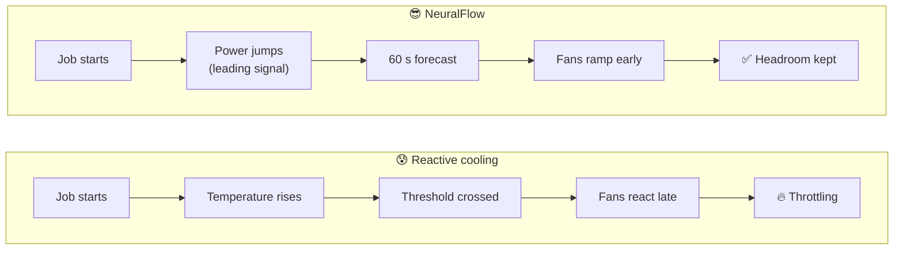
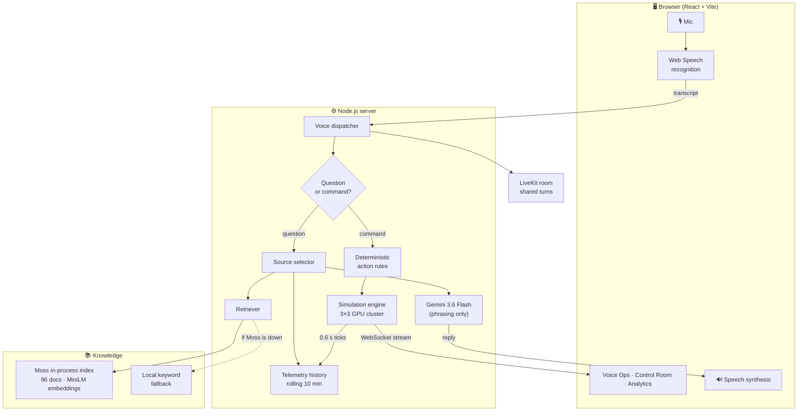
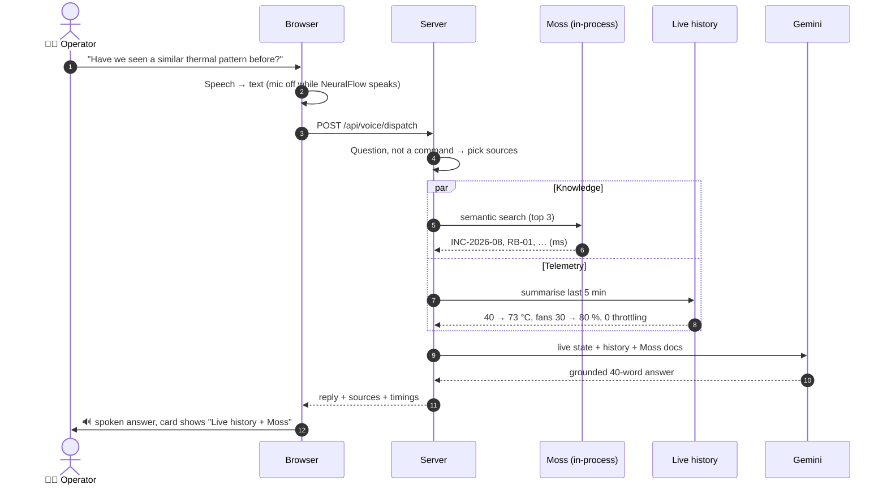
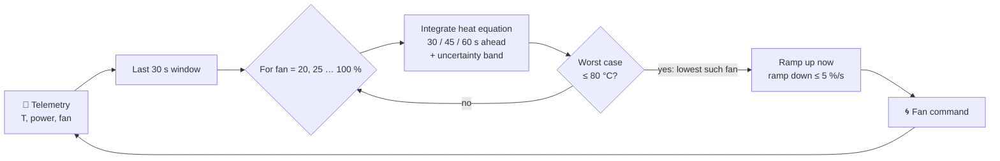
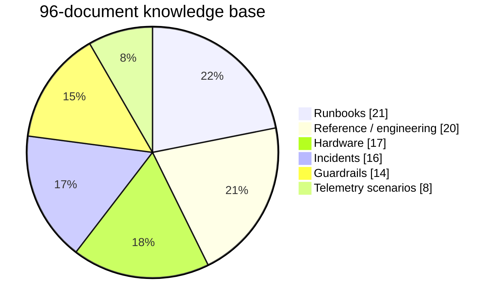
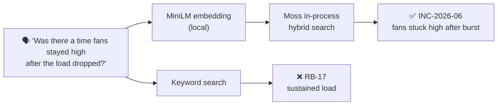
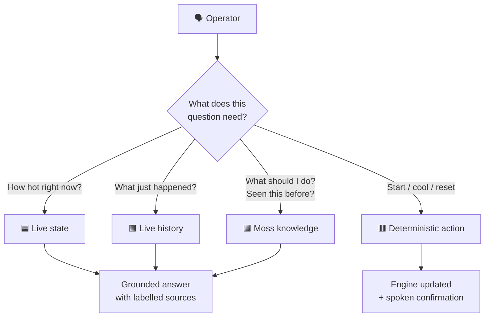
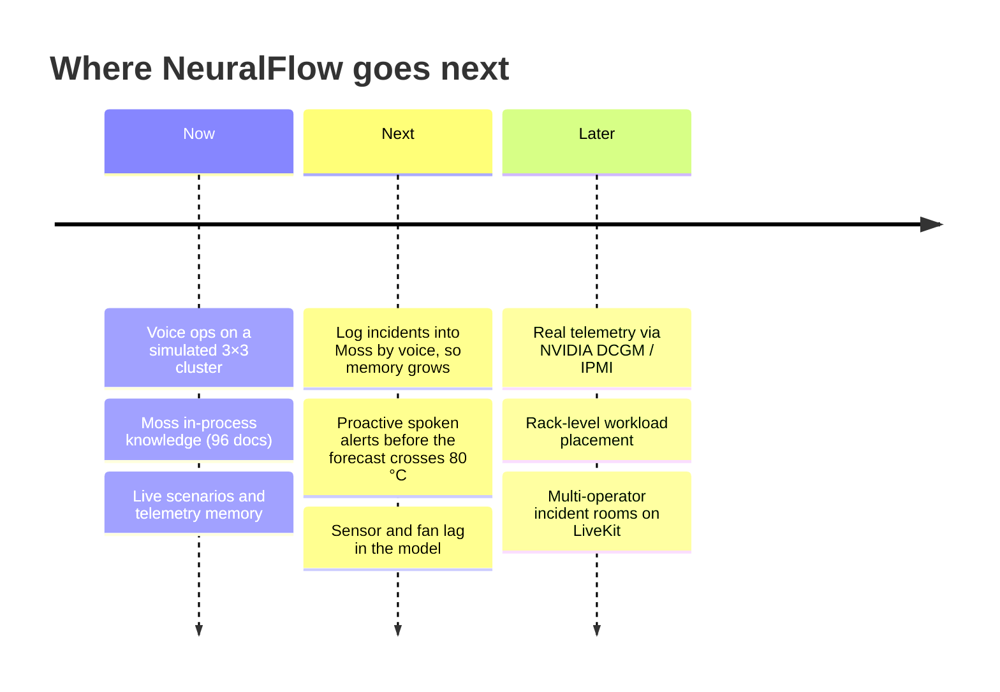

<div align="center">

# ⚡ NeuralFlow

### Voice-first thermal intelligence for GPU clusters

**Predict the heat. Protect the compute. Just ask.**


*Built for the YC × Moss hackathon · Real-Time Voice & Conversational AI track*

</div>

---

## 🌙 The 3 a.m. problem

A training run is burning through thousands of GPUs. One rack crosses **85 °C**, the GPUs protect themselves and **cut their clocks by 30 %**, and the whole job slows down. Nobody notices for twenty minutes, because the on-call engineer is staring at ten dashboards.

**NeuralFlow lets that engineer just ask.** It forecasts GPU temperature 60 seconds ahead, cools *before* the heat arrives, runs the incident by voice, and answers from the team's own runbooks and past incidents through **Moss**, in milliseconds.



---

## ✨ What it does

| | Capability | What you see |
|---|---|---|
| 🎙️ | **Voice operations** | Talk to the cluster: start a scenario, cool it, ask what happened. Hands off the keyboard. |
| 🔮 | **Predictive cooling** | For every candidate fan speed, NeuralFlow forecasts 30/45/60 s ahead and picks the lowest speed that keeps the worst case under 80 °C. |
| 🧠 | **Moss knowledge** | 96 runbooks, incidents, guardrails and hardware notes, searched semantically in-process. Paraphrased questions still find the right document. |
| 📈 | **Live memory** | A rolling 10-minute telemetry buffer answers *"what happened over the last five minutes?"* from real data, not documents. |
| 🧪 | **Live scenarios** | Play a training burst, inference or mixed workload on the live cluster at 1×, 5× or 10×. Every screen follows the same run. |
| 🛡️ | **Safe by design** | Actions are deterministic rules. The LLM only phrases answers, never touches the hardware. |
| 🔍 | **Honest provenance** | Every reply is labelled: live state, live history, Moss or local fallback, with measured milliseconds. |

---

## 🏗️ Architecture



### One voice turn, end to end



---

## 🔮 Predictive control

NeuralFlow watches **power draw**, which jumps the instant a job starts, while a reactive controller waits for the temperature to climb. Every tick it runs a small search over fan speeds:



The plant is a first-order thermal model of an H100-class GPU (heat capacity, fan-dependent cooling, 25 °C ambient), calibrated so a 700 W burst at minimum fan heads toward ~90 °C. Cooling genuinely has to act.

### Live result: 5-minute training burst

| Controller | Peak temperature | Time above 85 °C | Fan energy |
|---|---:|---:|---:|
| Reactive PID (standard baseline) | 85.7 °C | ~50 s | 10.5 Wh |
| **NeuralFlow** | **~73.5 °C** | **0 s** | 16.8 Wh |

NeuralFlow keeps about **12 °C of headroom** and **never throttles**, and it spends more fan energy to do it. That's the right trade: a fan costs a few watts, while throttling costs 30 % of a 700 W GPU's clock. Ask the agent *"compare PID versus NeuralFlow"* and it runs a fresh benchmark on the spot.

> These are simulator results, averaged over repeated runs, not measurements from a physical cluster. The baseline is a standard reactive PID; a carefully hand-tuned reactive controller narrows the gap in this idealised model, which has no sensor or fan lag.

---

## 📚 Moss context engine

Operators don't speak in runbook titles. Moss finds the right document even when the question shares no keywords with it.





### Benchmark: 20 paraphrased operator questions, same 96 documents

| Metric | 🟢 Moss | ⚪ Local keyword |
|---|---:|---:|
| Right document ranked first | **70 %** | 60 % |
| Right document in top 3 | **95 %** | 80 % |
| Median retrieval time | 13 ms | 1.9 ms |
| 95th-percentile retrieval time | 30 ms | 5 ms |

Moss finds the right knowledge far more often; keyword search is faster but wrong more often. In a separate 60-query in-process run, Moss's median was **6.5 ms** (p95 21 ms), with embeddings computed locally. Raw data: [`bench/moss-vs-local-96.json`](bench/moss-vs-local-96.json) and [`bench/moss-results.json`](bench/moss-results.json).

> **Local embeddings ≠ local fallback.** Moss search uses a local embedding model (`Xenova/all-MiniLM-L6-v2`). The *local fallback* is a separate keyword index, used only when Moss is unavailable or deliberately selected, and every reply says which one answered.

---

## 🧭 Multi-source grounding

Different questions need different evidence, and NeuralFlow never blurs what was **measured** with what was **remembered**.



Questions are routed away from actions, even without a question mark: *"was there a time…"*, *"have we seen…"* and *"when should we pre-ramp?"* search knowledge and **never** change the cluster.

---

## 🎙️ Things to say

| Say | What happens |
|---|---|
| **"Run training burst scenario"** | Resets the cluster and plays a 10-minute burst at 5× (about 2 min real time) |
| **"Run mixed scenario"** / **"Stop scenario"** | Idle → inference → burst on the live cluster / stop and hold |
| **"Diagnose cluster temperature"** | Current junction, fan and the 60 s forecast |
| **"Pre-ramp cooling fans"** | Fans to ≥ 80 %, held for 24 s |
| **"Emergency maximum cooling"** | Fans to 100 %, held for 24 s |
| **"Increase workload"** / **"Decrease workload"** | Steps AI, API, user and batch load within limits |
| **"What happened over the last five minutes?"** | Spoken recap from live telemetry |
| **"Have we seen a similar thermal pattern before?"** | Live history + Moss incidents |
| **"When should we pre-ramp cooling fans?"** | Answer from runbooks via Moss |
| **"Compare PID versus NeuralFlow"** | Runs a fresh 600 s benchmark and reads the result |
| **"Start / pause / reset simulation"** | Controls the live engine |

Every command also works typed into the command box.

---

## 🚀 Quick start

```bash
git clone https://github.com/its-yashjai/thecool.git
cd thecool && git checkout v8
cd thecool-main
npm install
cp .env.example .env.local   # add your keys
npm run dev                  # http://localhost:3000
```

Open it in **Chrome** (speech recognition), allow the microphone, and click once so the browser allows speech. Check the startup banner:

```text
──────── NeuralFlow status ────────
Retrieval : Moss in-process (embeddings: Xenova/all-MiniLM-L6-v2 (local, semantic))  [index: neuralflow-kb, docs: 96]
LiveKit   : real signed tokens, room neuralflow-ops
LLM       : gemini-3.6-flash via llm.hidevs.xyz (open questions only)
───────────────────────────────────
```

If it says `LOCAL KEYWORD FALLBACK`, Moss isn't configured or reachable. The app still works and says so on every answer.

### Environment

| Variable | Needed for | Notes |
|---|---|---|
| `MOSS_PROJECT_ID`, `MOSS_PROJECT_KEY` | Moss search | From [moss.dev](https://moss.dev) |
| `MOSS_INDEX_NAME` | Moss search | Default `neuralflow-kb`; created on first start |
| `MOSS_EMBEDDINGS=local` | Moss search | Recommended: local MiniLM vectors, no model download from Moss |
| `LIVEKIT_URL`, `LIVEKIT_API_KEY`, `LIVEKIT_API_SECRET` | Shared voice room | Optional; tokens are signed server-side |
| `LLM_API_KEY`, `LLM_BASE_URL`, `LLM_MODEL` | Natural-language answers | Optional; any OpenAI-compatible API. Without it, answers come from rules and documents |

Keys never leave the server.

---

## 🔌 API

| Endpoint | Purpose |
|---|---|
| `POST /api/voice/dispatch` | One voice turn: `{ transcript }` → reply, intent, sources, timings |
| `POST /api/scenario` · `POST /api/scenario/stop` | Play `{ pattern, duration, speed }` on the live cluster / stop it |
| `POST /api/moss/search` | Direct retrieval: `{ query, limit }` |
| `POST /api/moss/mode` | Force `moss`, `local` or `auto` retrieval |
| `GET /api/moss/stats` | Retrieval status and latency percentiles |
| `GET /api/telemetry/history` | Rolling telemetry summary (`?windowMs=`) |
| `POST /api/simulate` | Offline batch benchmark: `{ pattern, duration }` |
| `POST /api/control` | `play`, `pause`, `reset`, workload `params` |
| `GET /api/livekit/token` | Short-lived LiveKit access token |
| `GET /health` · `GET /api/health` | Liveness · full status |
| `WS /ws` | Live engine state every 0.6 s |

---

## 🗂️ Project structure

```text
thecool-main/
├── server.ts                 Express + WebSocket server, routes, tick loop
├── server/
│   ├── engine.ts             Live engine, scenarios, fan override, batch benchmark
│   ├── simulator.ts          First-order GPU thermal model + workload patterns
│   ├── neuralflow.ts         Predictive controller (forecast + fan search)
│   ├── pid.ts                Reactive PID baseline
│   ├── voice.ts              Intent routing, source selection, spoken replies
│   ├── retrieval.ts          Moss client, in-process index, local fallback
│   ├── embeddings.ts         Local MiniLM embeddings for Moss
│   ├── knowledge.ts          96-document knowledge base
│   ├── telemetryHistory.ts   Rolling 10-minute telemetry buffer
│   ├── llm.ts                Grounded answer phrasing (optional)
│   └── livekit.ts            Signed room tokens
├── src/
│   ├── context/VoiceContext.tsx   Mic, speech, turn-taking, dispatch
│   └── components/                Voice Ops, Control Room, Analytics, 3D stack
└── bench/                    Moss vs local retrieval benchmarks
```

---

## 🛡️ Design principles

- **Actions are rules, not guesses.** "Emergency cooling" does exactly the same thing every time; the LLM can't actuate anything.
- **Questions never actuate.** Asking about workload never changes the workload.
- **Provenance is always shown.** Moss vs local fallback, live data vs documents, measured milliseconds.
- **Graceful degradation.** No Moss → keyword fallback. No LLM → rule and document answers. No LiveKit → local voice. The demo never stalls.
- **No overclaiming.** Simulator results are labelled as such, and the benchmarks ship with their raw data.

---

## 🛣️ Roadmap



---

## 🏷️ Deploy (Render)

`render.yaml` deploys branch `v7` (the live Render service) with root directory `thecool-main`: build `npm ci && npm run build`, start `npm start`, health check `/health`. Set the environment variables above in the Render dashboard, then check:

```bash
curl https://your-app.onrender.com/api/health
curl https://your-app.onrender.com/api/moss/stats
```

---

<div align="center">

**NeuralFlow** · built by [Yash Jaiswal](https://github.com/its-yashjai)

*Use intelligence before the heat becomes the problem.*

</div>
