# NEURALFLOW

### Physics-Informed GPU Thermal Management

> **Predict. Prevent. Perform.**
>
> NeuralFlow is a real-time AI operations platform for proactive GPU thermal management. It combines physics-informed prediction, live telemetry, recent telemetry history, semantic retrieval with Moss, and Gemini-powered voice reasoning to help operators understand and control GPU thermal behavior before throttling occurs.

---

## ✦ What is NeuralFlow?

Traditional GPU cooling is often reactive: temperature rises, a threshold is crossed, and the cooling system responds.

NeuralFlow is built around a different idea:

> **Do not wait for the temperature to become dangerous. Understand where the system is heading, what just happened, what has happened before, and what action is safe next.**

The platform combines four complementary information sources:

| Source | Purpose |
|---|---|
| **Live State** | Understand what is happening right now |
| **Live History** | Understand how the system changed recently |
| **Moss Knowledge** | Retrieve runbooks, incidents, guardrails, hardware references, and engineering lessons |
| **Gemini** | Combine available evidence into a grounded explanation or decision |

NeuralFlow is designed as a **voice-first AI operations interface**, not simply a chatbot.

---

# ◈ Core Idea

## Reactive control

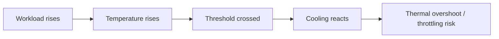

## NeuralFlow proactive control

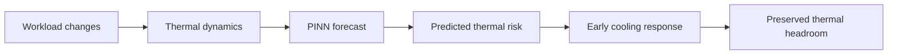

NeuralFlow treats the **future thermal trajectory** as an important control signal instead of relying only on the current sensor reading.

---

# ⚡ Key Capabilities

## 01 — Physics-Informed Prediction

NeuralFlow uses a Physics-Informed Neural Network (PINN) to estimate future thermal behavior over a roughly **30–60 second predictive horizon**.

A PID controller is retained as a reference baseline, making it possible to compare proactive prediction against conventional reactive control.

### Prediction concept

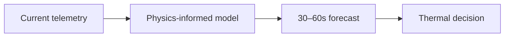

---

## 02 — GPU Digital Twin

The platform includes a GPU thermal simulation environment that acts as a digital twin of the monitored cluster.

It models:

- GPU temperature
- fan behavior
- workload intensity
- GPU power
- cluster behavior
- forecasted temperature
- throttle events
- thermal protection state

The reference environment is represented as a **3 × 3 GPU cluster**, enabling spatial hotspot and workload-placement analysis.

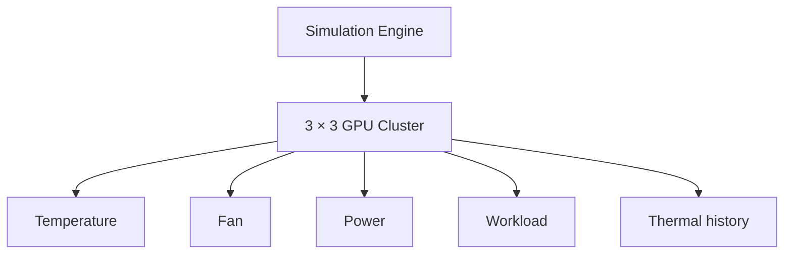

---

## 03 — Real-Time Voice Operations

NeuralFlow is designed to accept natural spoken questions and operational commands.

The current voice layer uses:

- Silero VAD for local voice activity detection
- Web Speech API for speech recognition
- Web Speech API for speech synthesis
- LiveKit for real-time room and participant communication
- server-side retrieval and reasoning

The voice interface can distinguish between questions and explicit control commands so that an informational question does not accidentally mutate the simulator.

---

# 🧠 Multi-Source Grounding

Different questions require different evidence.

A simple current-state question should not require a historical search. A historical question should not be answered from a single current sensor reading. A question about a previous incident should be able to connect recent behavior with stored operational knowledge.

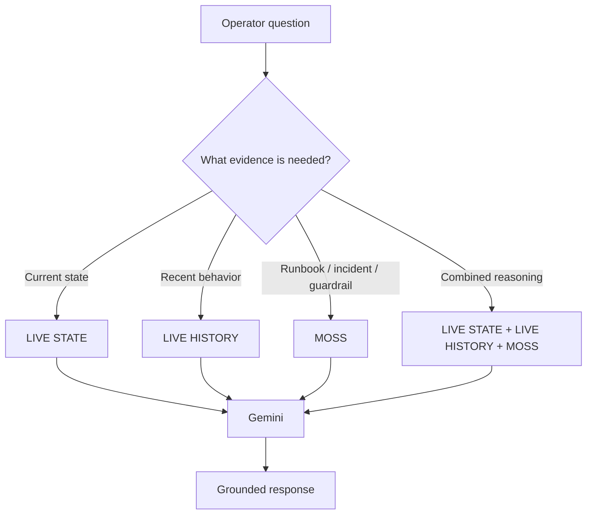

### Example

> **“What has happened to GPU-04 recently, and have we seen a similar thermal pattern before?”**

The system can combine:

**Live State** — current temperature, fan, workload, and power.

**Live History** — the recent temperature and workload trajectory.

**Moss** — previous incidents, procedures, guardrails, and engineering knowledge.

**Gemini** — one explanation grounded in those sources.

---

# 📈 Live Telemetry History

NeuralFlow maintains a bounded rolling history instead of treating the current snapshot as the entire story.

The current design keeps approximately **10 minutes of recent telemetry**, sampled around the simulator's **600 ms cadence**, for roughly **1,000 bounded snapshots**.

A smaller query window, such as five minutes, can be requested without discarding the larger rolling buffer.

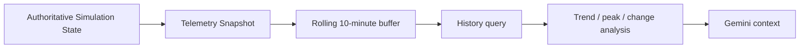

Live history is designed to answer questions such as:

- What changed recently?
- When did workload increase?
- How quickly did GPU-04 heat up?
- How did fan response change?
- What was the recent peak?
- Did workload rise before temperature rose?
- Did the system begin recovering?

Raw telemetry remains a runtime concern. Individual high-frequency readings are not treated as semantic knowledge documents.

---

# 📚 Moss Context Engine

Moss provides the semantic retrieval layer for NeuralFlow's project knowledge.

The current knowledge base contains **96 documents** spanning:

| Knowledge Area | Purpose |
|---|---|
| **Hardware** | GPU profiles, airflow, power, and thermal behavior |
| **Runbooks** | Operational procedures and response strategies |
| **Guardrails** | Thermal safety and control constraints |
| **Incidents** | Historical/reference events and lessons |
| **Telemetry / Scenarios** | Reference operational scenarios |
| **Engineering** | Thermal reasoning, control, and retrieval concepts |

The knowledge base was expanded from 24 to 96 documents to create a more realistic retrieval environment.

### Moss retrieval path

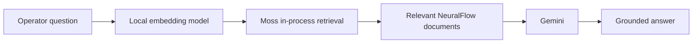

### Important terminology

**Local embeddings ≠ Local fallback.**

NeuralFlow uses `Xenova/all-MiniLM-L6-v2` locally as the embedding model in the Moss retrieval path.

The **Local fallback** is a separate keyword-retrieval baseline used when Moss is unavailable or when the operator intentionally selects Local mode.

---

# 🔬 Moss vs Local

NeuralFlow includes a controlled Moss-vs-Local demonstration mode.

The hidden retrieval control allows the same application to switch between:

- **Moss semantic retrieval**
- **Local keyword retrieval**

while leaving the rest of the reasoning pipeline unchanged.

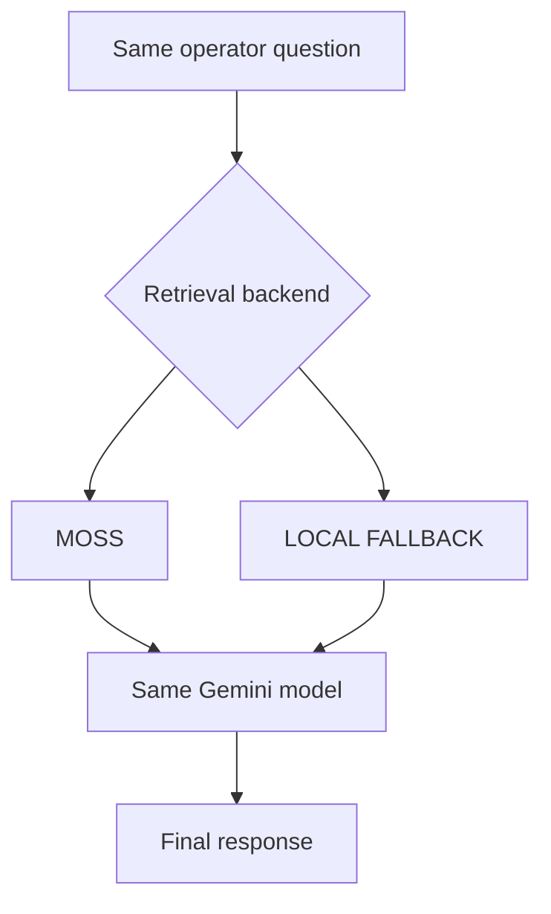

The comparison focuses on:

- Top-1 relevance
- Top-3 relevance
- retrieved document identity
- retrieval latency
- behavior on paraphrased operator questions

Raw retrieval scores are **not** compared directly across engines because their scoring semantics are not necessarily equivalent.

---

# 📊 Retrieval Benchmark

A 20-question paraphrased operator benchmark was run against the same 96-document knowledge base.

| Metric | Moss | Local |
|---|---:|---:|
| **Top-1 relevant** | **70%** | 60% |
| **Top-3 relevant** | **95%** | 80% |
| **Median retrieval latency** | 12.95 ms | **1.85 ms** |
| **P95 retrieval latency** | 30.2 ms | **4.97 ms** |

### What the benchmark means

The current benchmark shows a trade-off:

> **Moss retrieved relevant knowledge more often on this paraphrased query set, while Local keyword retrieval was faster in the same benchmark.**

This is intentional. The goal is not to make Local fail artificially. The goal is to measure whether semantic retrieval helps when the operator's vocabulary differs from the source text.

---

# 🛰️ Historical + Knowledge Reasoning

NeuralFlow can connect a current situation to previous project knowledge.

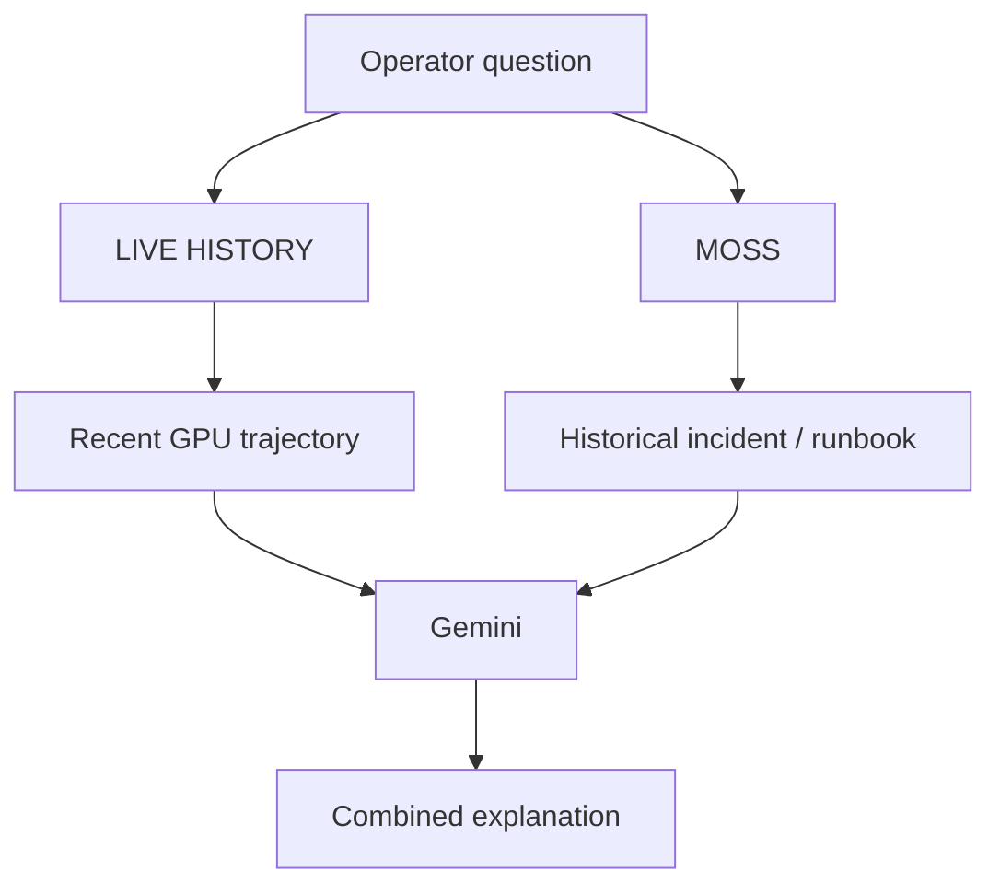

For example:

> **“What has happened to GPU-04 recently, and have we seen a similar thermal pattern before?”**

can connect the actual recent telemetry trajectory with a relevant incident or operational procedure.

The project intentionally distinguishes **live simulator history** from the **synthetic/reference historical records** stored in the knowledge base.

---

# 🛡️ Safety-Oriented Intent Routing

NeuralFlow separates **knowledge questions** from **operational commands**.

This prevents questions such as:

> “When should we increase workload?”

from being interpreted as:

> “Increase workload.”

Interrogative wording takes precedence when the user is asking for information. Explicit operational commands remain available for simulator actions.

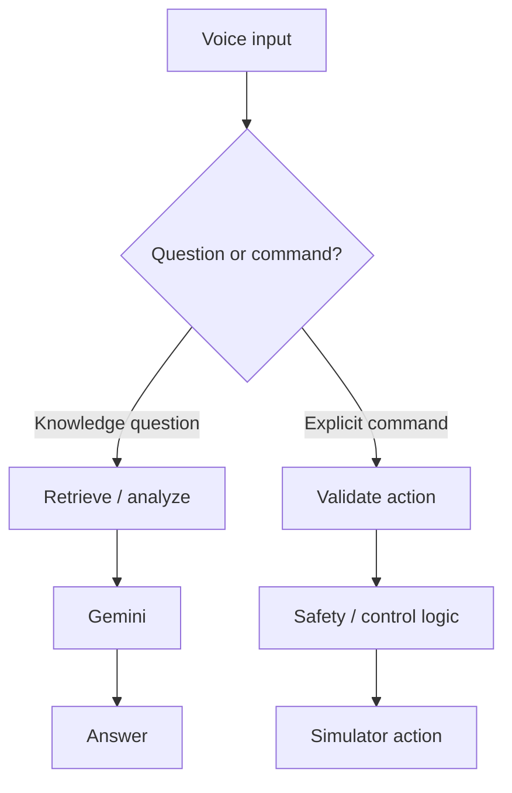

### Examples

**Knowledge behavior**

- “When should we pre-ramp cooling fans?”
- “Why is GPU-04 hotter?”
- “What happened during the previous incident?”

**Action behavior**

- “Increase workload.”
- “Pre-ramp cooling fans.”
- “Start simulation.”

Informational questions are intended to remain **non-mutating**.

---

# 🎙️ Voice Architecture

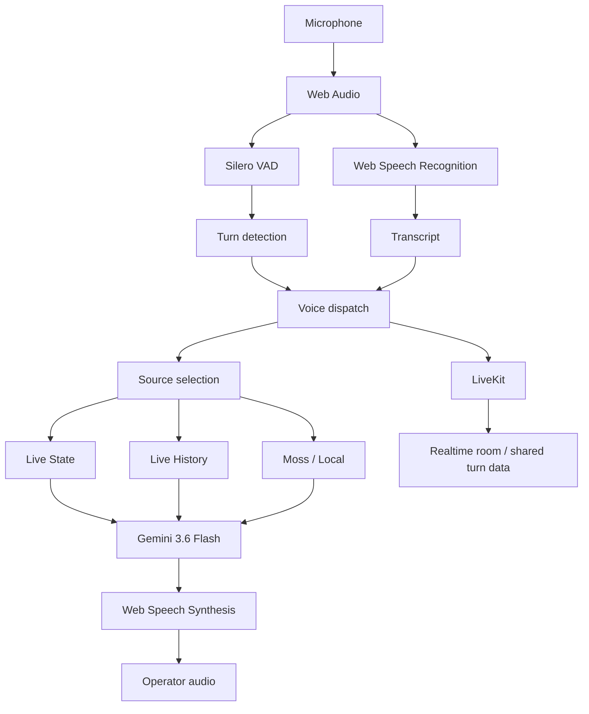

---

# 🧩 System Architecture

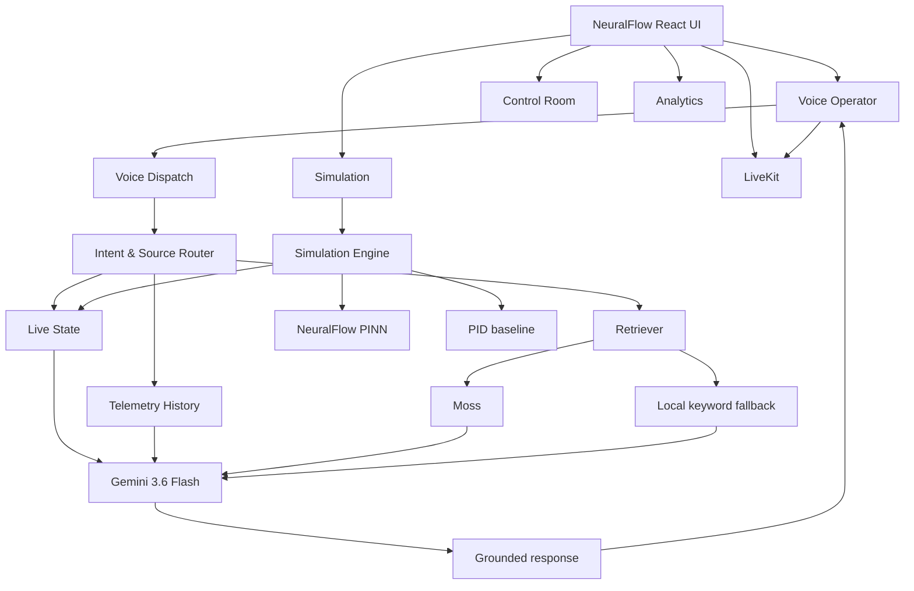

---

# 🌡️ Thermal Control Model

NeuralFlow uses layered control reasoning:

**Current state** — where the cluster is now.

**Thermal forecast** — where the temperature is heading.

**Historical trajectory** — how the system reached its current state.

**Operational knowledge** — what incidents and runbooks say.

**Control policy** — what response is permitted within thermal guardrails.

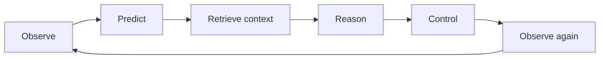

---

# 📌 Reference Thermal Guardrails

The reference project knowledge uses the following thresholds:

| Threshold | Meaning |
|---|---|
| **74°C** | Pre-cooling boundary |
| **82°C** | Stronger override / protection boundary |
| **85°C** | Thermal throttling point |
| **90°C** | Critical shutdown boundary |

These values belong to the project's reference control policy and should be presented as project simulation/guardrail values rather than universal GPU specifications.

---

# ⚙️ Reference Simulation Comparison

The project reference simulation reports:

| Metric | PID | NeuralFlow |
|---|---:|---:|
| Peak temperature | **84°C** | **71°C** |
| Cooling energy | **148 Wh** | **129 Wh** |
| Throttle events | **7** | **0** |
| Temperature variance | **±8.2°C** | **±3.1°C** |
| Energy saved | — | **12.8%** |
| PINN MAE | — | **1.4°C** |
| PINN RMSE | — | **1.9°C** |

These are **project reference / simulation results**, not measurements from a physical production GPU cluster.

---

# 🖥️ Operator Experience

NeuralFlow is designed as an AI infrastructure command center rather than a generic analytics dashboard.

The visual direction combines:

**Premium glassmorphism**

with

**vibrant AI infrastructure**

and

**aerospace-inspired control-room visualization**.

The interface emphasizes:

- GPU cluster health
- predictive thermal state
- voice operations
- cooling behavior
- thermal analytics
- retrieval provenance
- recent history
- control feedback

### Retrieval transparency

The interface distinguishes whether an answer used:

**Moss**

or

**Local fallback**

or

**Live state / Live history**.

This makes the reasoning path inspectable instead of hiding every response behind a generic “AI answer” label.

---

# 🔎 Example Operator Questions

### Live state

> **“What is the cluster temperature right now?”**

Uses current live state.

### Recent history

> **“What changed after the workload increased?”**

Uses recent telemetry history and current state.

### Knowledge

> **“When should we pre-ramp cooling fans?”**

Uses runbooks and guardrails.

### Historical reasoning

> **“Have we seen a similar thermal pattern before?”**

Uses historical/reference knowledge.

### Combined reasoning

> **“What has happened to GPU-04 recently, and have we seen a similar thermal pattern before?”**

Combines live state, live history, and project knowledge.

---

# 🧠 What Makes the Architecture Different?

NeuralFlow is not built around one static prompt.

It separates the questions an infrastructure operator actually asks:

```text
WHAT IS HAPPENING NOW?
        ↓
    LIVE STATE

WHAT JUST HAPPENED?
        ↓
   LIVE HISTORY

HAVE WE SEEN THIS BEFORE?
        ↓
       MOSS

WHAT SHOULD WE DO?
        ↓
   GEMINI + GUARDRAILS
```

The value comes from combining these sources without confusing their provenance.

---

# 🏗️ Technology Stack

| Layer | Technology |
|---|---|
| Frontend | React 18 |
| Build system | Vite |
| Language | TypeScript |
| Backend | Node.js + Express |
| Realtime | WebSocket + LiveKit |
| Voice activity detection | Silero VAD |
| Speech recognition | Web Speech API |
| Speech synthesis | Web Speech API |
| Retrieval | Moss |
| Local embedding model | Xenova/all-MiniLM-L6-v2 |
| LLM | Gemini 3.6 Flash via HiDevs |
| Predictive model | Physics-Informed Neural Network |
| Baseline controller | PID |
| Styling | Tailwind CSS |
| Live history | Bounded in-memory rolling buffer |

---

# 🔐 Design Principles

### Evidence first

Current telemetry, historical data, and knowledge are treated as separate sources.

### Provenance matters

The system distinguishes Moss from Local fallback instead of claiming Moss when it was not used.

### Questions should not accidentally actuate

Informational requests are routed away from simulator mutations.

### Keep recent history lightweight

Live history is bounded and kept in memory.

### Avoid unnecessary infrastructure

Recent live-history questions do not require Redis, Postgres, or a traditional external vector database in the current architecture.

### Transparent retrieval

The operator can inspect which retrieval path was used and what timing was measured.

---

# 🚀 Project Vision

NeuralFlow aims to move GPU infrastructure management from:

> **Reactive monitoring**

to:

> **Predictive, explainable, voice-driven operations.**

The long-term loop is:

**Observe** real-time infrastructure state.

**Predict** future thermal behavior.

**Remember** recent events and previous incidents.

**Retrieve** relevant operational knowledge.

**Reason** over multiple evidence sources.

**Act** within explicit safety boundaries.

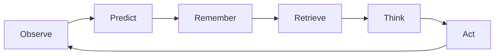

---

# 🌍 AI FOR A COOLER PLANET

AI infrastructure is becoming increasingly compute-intensive.

That makes thermal efficiency more than a monitoring problem.

NeuralFlow explores how predictive intelligence can help infrastructure operators:

- prevent avoidable thermal throttling
- preserve thermal headroom
- reduce unnecessary cooling effort
- understand recurring failure patterns
- make infrastructure decisions with better context

The objective is simple:

> **Use intelligence before the heat becomes the problem.**

---

## NEURALFLOW

### Predict the heat. Protect the compute. Operate with context.
